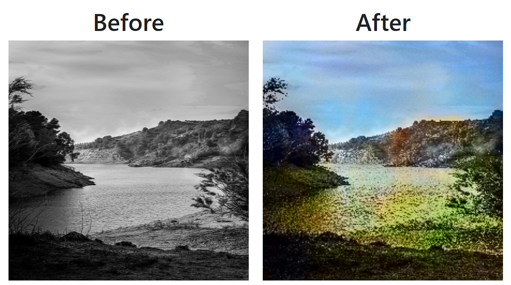

# Image Colorization
Deep learning project tentang pembuatan model yang dapat memprediksi warna pada gambar input berskala abu-abu (Image Colorization).

## Bagaimana model dilatih ?
* Menyiapkan dataset gambar dengan cara mengonversi gambar RGB ke channel LAB. 
* Kemudian, menggunakan kanal L sebagai input dan kanal AB sebagai target
* Melatih model DCNN yang terdiri dari Encoder-Decoder menggunakan dataset. 
* Hasil akhirnya model dapat memprediksi informasi warna dari gambar skala abu-abu yang diberikan.

## Jalankan di terminal
```
pip install -r requirements.txt
```

```
python app.py
```

## Contoh

<p align="center">
    
</p>

## 👤 Author
* Benediktus Hengki Setiawan : [Linkedin](https://www.linkedin.com/in/benngki/)
* Ramadhan Ihsani Yulfa : [Linkedin](https://www.linkedin.com/in/ramadhan-ihsani-yulfa/)
* Nicholas Daniel Wijaya
* Nicky Takeo Toari
